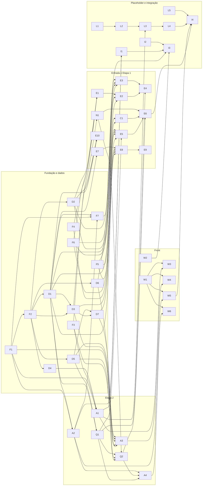

# Próximos passos · Módulo de Marketing

Plano de trabalho a partir do alicerce criado em 25/09/2026. O repositório já tem:

- a API subindo com envelope, segurança por JWT, `/health`, Flyway e Swagger;
- o front com layout, abas, camada da casca e cliente HTTP;
- o esqueleto do placeholder do Landing;
- o ambiente local em Docker.

Nenhuma funcionalidade de negócio existe ainda. Cada pasta tem um README com o que já existe: [marketing-api](marketing-api/README.md), [marketing-web](marketing-web/README.md), [landing-web](landing-web/README.md) e [infra](infra/README.md).

A referência de **o quê** fazer é o [documento norteador](Docs/documento-norteador.md). Este arquivo organiza **em que ordem** fazer e **o que depende do quê**. Se os dois divergirem, vale o norteador.

## Como ler

- Cada tarefa tem um código: **F** fundação do back, **D** dados (migrations), **E** entrada de leads e Etapa 1, **C** CRM, **N** notificações, **Q** qualificação, **A** APIs da Etapa 2, **W** front, **L** placeholder do Landing, **I** integração e entregas.
- **Bloqueado por:** o que precisa estar pronto antes de começar a tarefa.
- **Bloqueia:** o que só pode começar depois que a tarefa terminar.
- **X1, X2...** são dependências **de outros grupos ou decisões ainda abertas**. Elas estão na [lista de dependências externas](#dependências-externas-e-decisões-em-aberto).
- **(parcial)** quer dizer que dá para começar antes: por exemplo, programar contra a proposta que enviamos e ajustar quando o outro grupo responder.
- A coluna **§** aponta a seção do norteador com os detalhes.

## Visão geral das ondas

Tarefas da mesma onda podem ser feitas **ao mesmo tempo**, por pessoas diferentes. Uma onda só depende das anteriores.

| Onda | Tarefas | O que destrava |
|---|---|---|
| **0** · sem dependência interna | F1, F3, F4, F5, F6, W1, L1, L5, I2 (e W2, assim que X9 for resolvida) | a base de segurança, mensageria, clientes HTTP, testes, componentes do front e o placeholder |
| **1** | F2, N1, C1, L2 | a entidade base (liberando todas as migrations), os pedidos à plataforma e os eventos do placeholder |
| **2** | D1, D2, D4, D5, D6 | as tabelas principais |
| **3** | D3, E1, E3, E7, Q1, A1, A2 | a entrada de leads, a pontuação e as primeiras APIs usadas pelo front e pelo Landing |
| **4** | D7, E2, E5, E10, Q2, W3, W5, L3, I1, F7 | a drenagem, a etapa 2 do funil, o rodízio e as telas de Formulários e Leads |
| **5** | E4, E6, E8, A3, A4, L4 | a etapa 3 (fluxo expresso), a boas-vindas, as configurações e o painel |
| **6** | E9, W4, W6, I3, I4 | o aquecimento, as telas de Configurações e Painel, a entrega na plataforma e o teste de ponta a ponta |

**Caminhos críticos.** As cadeias mais longas têm 7 passos, e um atraso em qualquer uma delas empurra o fim do projeto. Todas começam em **F1 → F2 → D1**, então essas três tarefas são as mais urgentes:

```
F1 → F2 → D1 → Q1 → Q2 → E6 → I4      jornada do lead até o CRM (passando por E5 antes de E6)
F1 → F2 → D1 → Q1 → Q2 → A4 → W6      painel
F1 → F2 → D1 → D3 → D7 → A3 → W4      configurações
F1 → F2 → D1 → D3 → D7 → E8 → E9      boas-vindas e aquecimento
```

**Prioridade fora do caminho crítico:** a **A1 (API de formulários)**. O Landing do Grupo 7 vai ler os campos do formulário dela, então ela é um contrato com outro grupo e deve sair cedo.

## Divisão sugerida em trilhas

Cada trilha pode ser de uma pessoa ou dupla. No começo, as trilhas 2 e 3 esperam a fundação. Enquanto isso, elas pegam as tarefas da onda 0 que não dependem de nada.

| Trilha | Tarefas | Na onda 0, começa por |
|---|---|---|
| **1 · Back: fundação e dados** | F1, F2, F7, D1–D7 | F1 → F2 (desbloqueia as migrations) |
| **2 · Back: entrada de leads e Etapa 1** | E1–E10, C1, N1 | F4, F5, F6 |
| **3 · Back: Etapa 2 (qualificação e APIs)** | Q1, Q2, A1–A4 | F3, depois N1; assim que F2 sair, D4 → A1 |
| **4 · Front** | W1–W6 | W1 (componentes do Design System) |
| **5 · Placeholder, integração e entregas** | L1–L5, I1–I4 | L1, L2, L5, I2 |
| **Articulação com outros grupos** | X1–X11 | enviar os pedidos X1, X2, X3, X7 e X9 logo, porque eles demoram |

## Tarefas

### Fundação do back-end (F)

| ID | Tarefa | Bloqueado por | Bloqueia | § |
|---|---|---|---|---|
| **F1** | Ler do JWT o `tenant_id`, o `sub` (usuário) e as permissões, e transformar as permissões em *authorities* para o `@PreAuthorize`. Criar um jeito único de obter o tenant e o usuário atuais. Usar o `exemplo-modulo` do `infra-integrador-2026` como referência | — | F2, F7, A1, A2, A3 | 1, 6 |
| **F2** | Classe base das entidades com as sete colunas (`id`, `tenant_id`, datas, `created_by`/`updated_by` vindos do token), *soft delete* e filtro automático por tenant. Resposta paginada padrão `{itens, pagina, tamanho, total}`, com `tamanho` máximo de 100 e `ordenar` | F1 | D1, D2, D3, D4, D5, D6 | 3, 6 |
| **F3** | Publicador de eventos: envelope da §9.7 (`id`, `tipo`, `versao`, `tenantId`, `moduloOrigem`, `ocorridoEm`, `usuarioId`, `correlacaoId`, `dados`), propriedade `user_id = mq_marketing` e envio **só depois do commit** | — | N1, Q2, A1 | 8 |
| **F4** | Base de consumo: declarar a fila `marketing.landing-leads` (ligada a `landing.eventos`) e a DLQ `marketing.landing-leads.dlq` (depois de 3 falhas); consumo idempotente com `eventos_processados` | — | E1, E5 | 5, 8 |
| **F5** | Cliente HTTP para outros módulos: token de serviço (`clientId = marketing`, `SVC_MARKETING_SEGREDO`), `X-Tenant-Id`, timeout de 3 s, endereço por variável de ambiente, chamando direto pelo nome do container | — | E3, E5, C1 | 6 |
| **F6** | Infra de testes: RabbitMQ no Testcontainers e WireMock para CRM, Landing, identity e Graph API do Meta | — | E1, E3, E5, C1 | 10 |
| **F7** | Testes do checklist da plataforma: `403` sem permissão, cabeçalho de 32 KB, `404` para lead de outro tenant e `tenantId` do corpo ignorado | F1, D1, A2 | I3 | 10 |

### Dados: migrations do Flyway (D)

Uma migration por tarefa, na ordem dos números. Todas com as sete colunas obrigatórias e os tipos da seção 3 do norteador.

| ID | Tarefa | Bloqueado por | Bloqueia | § |
|---|---|---|---|---|
| **D1** | `V2`: `leads` (com `temperatura` gerada a partir da `etapa` e as chaves únicas), `lead_eventos` (com `sequencia`, usada pelo SSE) e `lead_consentimentos` (só inclusão) | F2 | F7, D3, E2, E5, E7, E8, E10, Q1, A2 | 3 |
| **D2** | `V3`: `leads_entrada_buffer` | F2 | E1, E2, E3, E10 | 3 |
| **D3** | `V4`: `modelos_mensagem`, `lead_comunicacoes` e `ciclo_vida_configuracoes` | F2, D1 | D7, E8, E10, A3 | 3 |
| **D4** | `V5`: `formularios` e `formulario_versoes` (versão publicada nunca muda) | F2 | A1 | 3, 9.5 |
| **D5** | `V6`: `regras_pontuacao`, `qualificacao_configuracoes` e `vendedores_rodizio` | F2 | D7, Q1, Q2, A3 | 3, 9.3 |
| **D6** | `V7`: `canais_anuncio`, com os segredos do Meta cifrados e nunca devolvidos pela API | F2, X6 | E3, A3 | 3, 9.4 |
| **D7** | Valores iniciais por tenant: modelo de boas-vindas padrão, regras de pontuação iniciais (tabela da 9.3), configurações de qualificação e de ciclo de vida. Criados na primeira vez que o tenant usa o módulo | D3, D5 | E8, A3 | 3, 9.3 |

### Entrada de leads e Etapa 1 (E, C, N)

| ID | Tarefa | Bloqueado por | Bloqueia | § |
|---|---|---|---|---|
| **E1** | Consumir os eventos das etapas 0 e 1 (`landing.visita.registrada`, `landing.formulario.aberto`, `landing.contato.informado`) e gravar no buffer | F4, F6, D2, X1 (parcial) | E2 | 5, 8 |
| **E2** | Job de drenagem do buffer (4.1), parte do Landing: a cada 5 min, em lotes de 500; resolve a identidade (`visitante_id` → e-mail/telefone); faz upsert em `leads`; grava `lead_eventos` e o consentimento da etapa 1; nunca rebaixa a etapa | D1, D2, E1 | E4 | 4.1, 5 |
| **E3** | Webhook público do Meta: handshake (`hub.challenge`), validação HMAC com o segredo do tenant, resolução do tenant pelo subdomínio e gravação no buffer | F5, F6, D2, D6, X4 | E4 | 6 |
| **E4** | Drenagem dos leads do Meta: busca os dados na Graph API, aplica o `mapeamentoCampos` e pontua | E2, E3, Q1, X5 | — | 4.1 |
| **E5** | Consumir a etapa 2 (`landing.formulario.atualizado`): grava direto em `leads`, consulta as respostas em `GET /api/landing/envios/{envioId}`, recalcula a pontuação e grava o consentimento | F4, F5, F6, D1, Q1, X1 (parcial) | E6 | 5 |
| **E6** | Consumir a etapa 3 (`landing.formulario.recebido`), no fluxo expresso: grava os ids do CRM, guarda as respostas, pontua, atribui vendedor, cria a oportunidade no CRM e notifica. Precisa funcionar com CRM fora do ar e com `empresaId` nulo | E5, Q2, C1, N1 | I4 | 5, 6 |
| **E7** | Descadastro público: `GET /public/marketing/descadastro/{token}` mostra a confirmação, e o `POST` efetiva o opt-out e grava a revogação (com IP e *User-Agent*) em `lead_consentimentos` | D1 | E8 | 6 |
| **E8** | Envio de e-mail por SMTP (Mailpit local) e job de boas-vindas (4.5): uma vez por lead, com os dois gatilhos (enviou o formulário; virou MQL com consentimento), sempre com o link de descadastro | D1, D3, D7, E7, X3 (parcial) | E9 | 4.5 |
| **E9** | Job de aquecimento (4.2): cadência de e-mails para as etapas 0 e 1 com consentimento; confere o opt-out antes de enviar e esgota ao fim da sequência | E8, X11 (parcial) | — | 4.2 |
| **E10** | Job de anonimização LGPD (4.3): zera os dados pessoais depois do prazo de retenção e nunca apaga a linha | D1, D2, D3 | — | 4.3 |
| **C1** | Cliente do CRM: `POST /api/crm/oportunidades` com o payload proposto na seção 6, isolado numa classe só (o contrato ainda pode mudar) | F5, F6, X2 (parcial) | E6 | 6 |
| **N1** | Pedidos à plataforma em `identity.entrada`: notificação `NOVO_LEAD` e registro na timeline | F3 | E6, Q2 | 8 |

### Etapa 2: qualificação e APIs (Q, A)

| ID | Tarefa | Bloqueado por | Bloqueia | § |
|---|---|---|---|---|
| **Q1** | Motor de pontuação: soma as regras ativas (cada critério conta uma vez, valendo a de mais pontos), define a faixa (`mql_quente` ≥ 70, `mql_morno` 40–69, `nutricao` < 40), grava o detalhe e registra a mudança de faixa. Com o teste de um lead de cada faixa | D1, D5 | E4, E5, Q2, A4 | 9.3 |
| **Q2** | Rodízio: atribui o vendedor ativo que recebeu há mais tempo; fora do horário comercial, fica "aguardando"; job 4.4 de atribuição pendente; reatribuição manual (`PUT /leads/{id}/vendedor`); evento `marketing.lead.atribuido`. Com os testes de 3 leads e 2 vendedores, e de fora do horário | Q1, D5, F3, N1, X7 (parcial) | E6, A4 | 9.3, 4.4 |
| **A1** | API de formulários: listar, criar, `GET /formularios/{id}` (versão ativa, também para o Landing com token de serviço) e `PUT` que publica uma versão nova e emite `marketing.formulario.publicado`. Com o teste de que publicar não altera a versão anterior | F1, F3, D4 | I1, W3, L3 | 9.5 |
| **A2** | API de leads: lista paginada com filtros, detalhe, `GET /leads/{id}/resumo` (sem dado pessoal) e busca global `GET /busca?q=`. O detalhe ganha seções à medida que as outras tarefas ficam prontas | F1, D1 | F7, A4, W5, I1 | 9.2, 9.6 |
| **A3** | APIs de configuração: canais de anúncio, modelos de mensagem, ciclo de vida, qualificação, regras de pontuação e vendedores do rodízio | F1, D3, D5, D6, D7 | W4 | 9.4 |
| **A4** | API do painel: `GET /painel` com as agregações (cache Caffeine por tenant) e SSE em `/painel/eventos` | A2, Q1, Q2, X8 (parcial) | W6 | 9.1 |

### Front-end (W)

As telas podem começar antes da API ficar pronta, com dados fictícios no formato combinado. Mas só ficam **prontas** quando estiverem ligadas à API de verdade.

| ID | Tarefa | Bloqueado por | Bloqueia | § |
|---|---|---|---|---|
| **W1** | Componentes do Design System que faltam em `components/ui`: `Modal`, `Input`, `Select`, `Textarea`, `FormSection`, `FormField`, `SearchBar`, `FilterBar`, `Pagination`, `ViewToggle`, `DetailField`, `DetailSection`, `Stepper` e `statusBadge` | — | W3, W4, W5, W6 | DS |
| **W2** | Integração com a casca real: conferir o formato das mensagens com o `exemplo-modulo`, o tema (`data-tema`) e a altura; esconder as abas sem permissão | X9 | I3 | 9 |
| **W3** | Tela **Formulários**: lista, editor de campos (fixos travados e configuráveis), reordenar, aviso ao remover campo usado em regra de pontuação, pré-visualização e botão Publicar | W1, A1 | — | 9.5 |
| **W4** | Tela **Configurações**, com quatro abas: canais de anúncio (segredos do Meta só de escrita e URL do webhook), modelos de mensagem, ciclo de vida, e qualificação e distribuição | W1, A3 | — | 9.4 |
| **W5** | Tela **Leads**: lista com filtros e paginação; detalhe em modal com contato, consentimentos, pontuação, timeline, e-mails e CRM | W1, A2 | I4 | 9.2 |
| **W6** | Tela **Painel**: funil, qualificação, série temporal, campanhas, canais, distribuição e leads recentes, com atualização por SSE | W1, A4 | — | 9.1 |

### Placeholder do Landing (L)

| ID | Tarefa | Bloqueado por | Bloqueia | § |
|---|---|---|---|---|
| **L1** | Página: gerar o `visitanteId` em cookie e guardar UTM, `fbclid` e `gclid` | — | L2 | 06* |
| **L2** | Publicar os cinco eventos em `landing.eventos` como `mq_landing`, com o envelope da §9.7 | L1, X1 (parcial) | L3 | 06* |
| **L3** | Formulário desenhado a partir de `GET /api/marketing/formularios/{id}` (cache por versão, renovado ao receber `marketing.formulario.publicado`), com o consentimento carregando IP, *User-Agent* e versão do termo | L2, A1, X10 | L4 | 06* |
| **L4** | Gravar os envios e expor `GET /api/landing/envios/{envioId}` | L3, X10 | I4 | 06* |
| **L5** | Stub do CRM para o ambiente local: `POST /api/crm/empresas`, `/contatos` e `/oportunidades` (Prism a partir do `crm.yaml` do infra ou um stub próprio) | — | I4 | 06* |

\* Contexto do ambiente local, fora do norteador: resumo no [README do landing-web](landing-web/README.md) e o contrato em [Docs/contratos/landing-requisitos.md](Docs/contratos/landing-requisitos.md).

### Integração e entregas (I)

| ID | Tarefa | Bloqueado por | Bloqueia | § |
|---|---|---|---|---|
| **I1** | Atualizar os contratos em `Docs/contratos/`: `marketing.yaml` com o que outros módulos consomem (formulários, resumo, busca) e `marketing.asyncapi.yaml` com `marketing.formulario.publicado` | A1, A2 | I3 | 10 |
| **I2** | CI: publicar as imagens `marketing` e `marketing-front` no GitHub Container Registry com o workflow reutilizável `publicar-imagem.yml` | — | I3 | 10 |
| **I3** | Entrega no `infra-integrador-2026`: contratos, `permissoes/marketing.yaml`, `modulos/marketing.json` e variáveis de imagem no `.env.example`, seguidos da sessão do checklist (19 itens) com o Grupo 2 | F7, I1, I2, W2 | — | 10 |
| **I4** | Teste de ponta a ponta no ambiente local: anúncio → formulário → eventos → lead → pontuação → vendedor → oportunidade no stub do CRM → lead visível na tela | E6, L4, L5, W5 | — | — |

## Dependências externas e decisões em aberto

Estas não se resolvem programando: precisam de resposta de outro grupo, dos professores ou de uma decisão do Grupo 4. A lista completa está na seção 11 do norteador.

| ID | O que falta | Com quem | Bloqueia |
|---|---|---|---|
| **X1** | Aceite da proposta ao Landing: os cinco eventos, `visitanteId`/`envioId`, consentimento com IP, *User-Agent* e versão do termo, `GET /api/landing/envios/{envioId}` e campos do formulário definidos pelo Marketing | Grupo 7 | E1, E5, L2 (parcial: seguimos a proposta) |
| **X2** | `POST /api/crm/oportunidades` no contrato do CRM e `servicos: [marketing]` em `crm.oportunidade.criar` | Grupo 6 | C1 (parcial: payload proposto) |
| **X3** | Variáveis de SMTP para o `marketing` no compose da plataforma e o provedor de e-mail fora do desenvolvimento | Grupo 2, professores | E8 (parcial: Mailpit local) |
| **X4** | Exceção ao envelope para o `hub.challenge` do Meta (texto puro) e o rate limit de 120/min em `/public/**` | Grupo 2 | E3 |
| **X5** | Token da página do Meta e saída do container para a internet (Graph API) | Grupo 4, Grupo 2 | E4 |
| **X6** | Onde guardar os segredos do Meta por tenant (proposta: colunas cifradas em `canais_anuncio`) | Grupo 4 | D6 |
| **X7** | Listar usuários com perfil VENDEDOR no identity | Grupo 2 | Q2 (parcial: cadastro manual dos ids) |
| **X8** | SSE passando pelo gateway (regra de `504` em 3 s) | Grupo 2 | A4 (parcial: polling como alternativa) |
| **X9** | Se a casca usa o `itensSubmenu` do `modulos/marketing.json` para desenhar subitens na sidebar (o front já tem as abas) | Grupo 2 | W2 |
| **X10** | Placeholder: como obter o token de serviço do `landing` no identity de desenvolvimento, e onde guardar os envios (memória, arquivo ou schema `landing`) | Grupo 4 (com o Grupo 2 para o token) | L3, L4 |
| **X11** | Consentimento dos leads do Meta antes do aquecimento; destinatário da notificação quando não há vendedor; acesso do vendedor ao lead notificado; régua de nutrição da etapa 2 | Grupo 4 | E9 (parcial); influencia Q2 e N1 |

## Mapa das dependências internas

Uma seta `A --> B` quer dizer que **A bloqueia B**. As dependências externas (X) ficaram de fora para o desenho não poluir: elas estão na tabela acima.



## Ao terminar uma tarefa

- Branch própria (`feat/...`, `fix/...`, `docs/...`) e PR para a `main`; commits no formato `<tipo>(<contexto>): <descrição>`.
- Se a tarefa mudou o desenho (tabela, rota, permissão ou evento), atualize o norteador no mesmo PR, incluindo o registro de alterações (seção 12).
- Atualize o README da pasta, se a estrutura ou as classes mudaram, e marque a tarefa aqui como feita.
